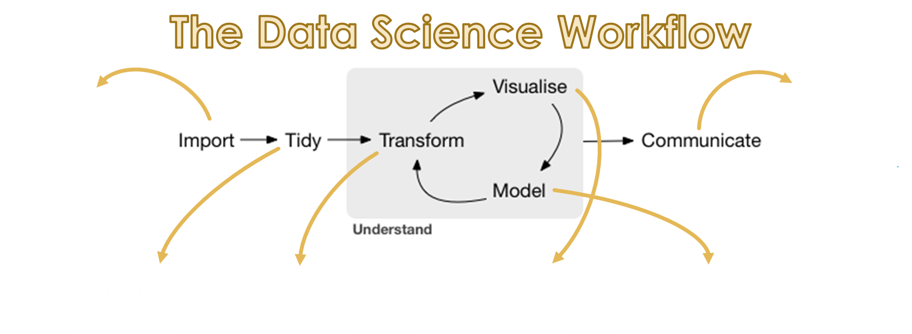
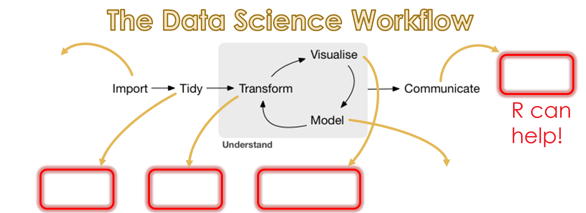
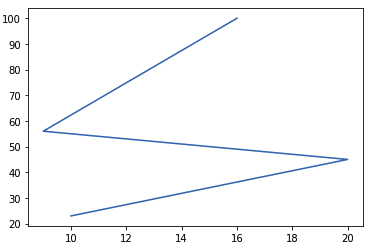
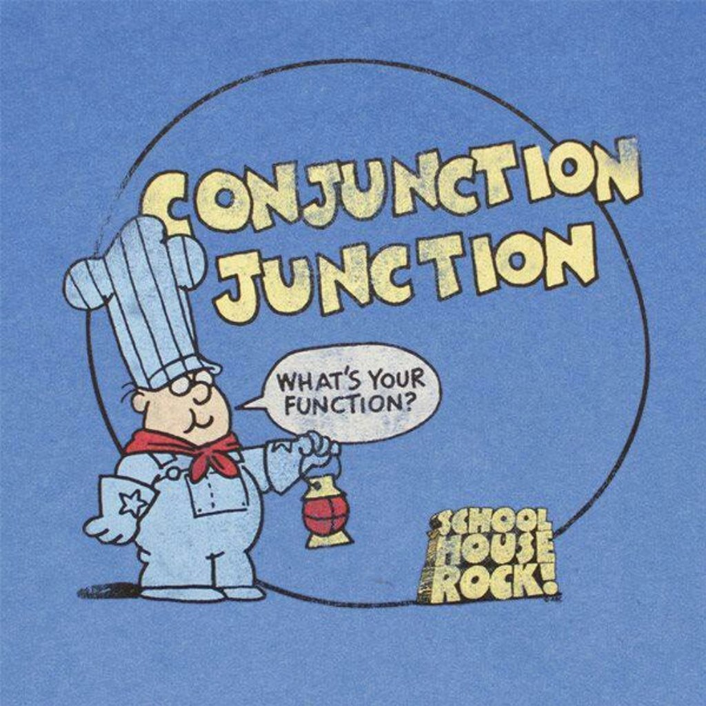
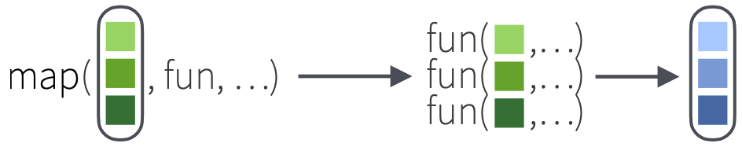
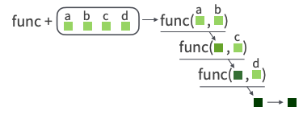
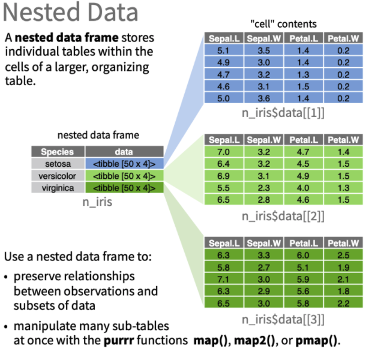

```{r setup, include=FALSE}
knitr::opts_chunk$set(cache = TRUE, warning = FALSE)
```

# Credit

<!-- [Phil Chodrow](https://www.philchodrow.com/) (ORC PhD '20)   -->

Phil Chodrow (ORC PhD '20)

Ted Papalexopoulos (ORC PhD '22)

Josh Wilde (ORC PhD '22)

# Why are we here?

```{r, out.height = 400, echo = FALSE, fig.align='center'}

```

## Data science in a nutshell

<br/>

{style="background: transparent"}

<br/> (*Image credit: Hadley Wickham*)

## R and RStudio

> -   RStudio is an open-source IDE for R, a programming language for
>     statistical computing.
> -   **In my opinion**, R is not a useful tool without RStudio. With
>     RStudio, R becomes very valuable for exploration and
>     visualization!
> -   R is best suited for data processing and analysis due to highly
>     powerful statistical packages

## Data science in a nutshell

<br/>

{style="background: transparent"}

##### My goals for today:

-   Sense of R's utility for your own projects

-   Clear idea of where to turn if you'd like to learn more

<br/>

## Topics

> 1.  Tidy data
> 2.  Visualization
> 3.  Functional data wrangling

# Getting the ball rolling, `tidy` style

## Agenda

> 1.  **The shortest possible base R intro**
> 2.  The `tidyverse` and its verbs
> 3.  Philosophy of tidy data
> 4.  How to create tidy datasets, and why you want to

## Variable Assignments

You can create new objects with `<-`:

```{r}
three_times_four <- 3 * 4
```

. . .

All R statements where you create objects, **assignment** statements,
have the same form:

```{r eval = FALSE}
object_name <- value
```

## Vectors and Vectorization

The primary data type in R is the vector (as in a container vector, not
a mathematical vector).

Even scalars like our variable `three_time_four` are actually vectors!

```{r echo=TRUE}
three_times_four
is.vector(three_times_four)
```

## Vectors and Vectorization

Vectors with more than one element are created using the concatenation
function `c()`, as in

```{r echo=TRUE}
vector_A <- c(1,2,3)
vector_B <- c(2,4,6)
```

## Vectors and Vectorization

`R` functions are naturally vectorized:

```{r}
B_divided_by_A <- c()

for(i in 1:3){
  B_divided_by_A[i] <- vector_B[i]/vector_A[i]
}

B_divided_by_A == (vector_B/vector_A)
```

## Indexing Vectors and Dataframes (Tibbles)

To access a single column of a dataframe, we use `$`

```{r echo=TRUE}
cars$speed
```

. . .

To index a specific element(s) of a vector or dataframe, we use `[ ]`.

```{r echo=TRUE}
cars$speed[1:5]
```

## Functions

R has a large collection of built-in functions that are called like
this:

```{r eval = FALSE}
function_name(arg1 = val1, arg2 = val2, ...)
```

. . .

A single `?` brings you to the function documentation **without leaving
RStudio**. This is incredibly useful!

```{r eval = FALSE}
?summary()
```

## Hands-on: user-defined functions

## That's it for base R!

```{r include=FALSE}
library(tidyverse)
raw_listings <- read_csv('data/listings.csv')
clean_price <- function(price) as.numeric(gsub('\\$|,', '', price))
```

## Agenda

1.  The shortest possible base R intro
2.  **The `tidyverse` and its verbs**
3.  Philosophy of tidy data
4.  How to create tidy datasets, and why you want to

## Motivation

To determine the count of rooms by type that accommodate four people or
more, we can type:

```{r echo=TRUE}
table(raw_listings$room_type, raw_listings$accommodates >= 4)[,"TRUE"]
```

This code gets us what we want but seems pretty hard to read and debug.
There must be a better way!

## Behold the `tidyverse`

> -   Hadley Wickham introduced a suite of packages providing an
>     elegant, unified approach to handling data in R (check out [the
>     paper](http://vita.had.co.nz/papers/tidy-data.html)!).
> -   Motivating observation: data *tidying* and *preparation* consume a
>     majority of the data scientist's time
> -   The `tidyverse` is a set of functions based on **verbs** and a
>     nifty **chaining operator** (`%>%`) serving like a pipeline from
>     one function to another:

. . .

```{r eval=FALSE}
my_dataframe %>% My_Function == My_Function(my_dataframe) 
```

## Feel the Power

That ugly table function from before?

```{r eval=FALSE}
table(raw_listings$room_type, raw_listings$accommodates >= 4)[,"TRUE"]
```

. . .

Using the `tidyverse`, this becomes

```{r echo=TRUE}
raw_listings %>%
  filter(accommodates >= 4) %>%
  select(room_type) %>%
  table()
```

## Some `tidyverse` Verbs

We just used two key `tidyverse` verbs:

> -   `select` a specific **column(s)**
> -   `filter` our table's **rows** based on a specific condition(s)

. . .

Let's look at some more verbs.

## Mutate

Add new columns and alter existing ones with `mutate`

```{r echo=TRUE}
raw_listings %>%
  mutate(nprice = clean_price(price)) %>%
  select(name, price, nprice) %>% 
  head()
```

## Arrange

`arrange` the listings in `desc`ending order by `nprice` to see the
highest-priced listings:

```{r echo=TRUE}
raw_listings %>%
  mutate(nprice = clean_price(price)) %>%
  select(name, price, nprice) %>%
  arrange(desc(nprice)) %>%
  head()
```

## Bonus verb: `count`

`count(...)` the number of occurrences of each combination of values:

```{r echo=TRUE}
raw_listings %>% count(property_type, bedrooms)
```

## Hands-on: Verbs and aggregation

## Key `tidyverse` verbs

-   `select` subset of columns
-   `filter` subset of rows
-   `mutate` to add columns
-   `arrange` to sort rows
-   `count` rows that meet certain conditions
-   `summarise` the results of multiple rows with a function

## Agenda

1.  The shortest possible base R intro
2.  The `tidyverse` and its verbs
3.  **Philosophy of tidy data**
4.  How to create tidy datasets, and why you want to

## The tidy data philosophy

Consider the following data below. How many variables does this dataset
contain?

| Company | Qtr.1     | Qtr.2    | Qtr.3     | Qtr.4     |
|---------|-----------|----------|-----------|-----------|
| ABC     | \$134.01  | \$256.77 | \$1788.23 | \$444.37  |
| XYZ     | \$2727.11 | \$567.23 | \$321.01  | \$4578.99 |
| GGG     | \$34.31   | \$459.01 | \$123.81  | \$5767.01 |

. . .

The correct answer is **3**. The variables are `Company`, `Quarter` and
`Earnings`.

## What is tidy data?

A dataset is tidy if it satisfies the following conditions:

> 1.  Each variable must have its own column.\
> 2.  Each observation must have its own row.\
> 3.  Each value must have its own cell.

. . .

Sounds simple, right? Yet a lot of data isn't formed that way, as we
just saw.

## Tidying up

In the `tidyverse`, we'd rather have the table represent "quarterly
earnings," with each row containing a single observation of a single
quarter for a single company, and columns representing the company,
quarter, and earnings.

. . .

Something like this:

| Company | Quarter | Earnings  |
|---------|---------|-----------|
| ABC     | Qtr.1   | \$134.01  |
| ABC     | Qtr.2   | \$256.77  |
| ABC     | Qtr.3   | \$1788.23 |
| ...     | ...     | ...       |

## Why tidy data?

Consider the first table of quarterly earning data, which we say is in a
**wide** format, and the second table of quarterly earning data, which
we say is in a **long** format.

Suppose we wanted to compare each company's earnings from the first half
of the year to their earnings from the second half of the year.

## Why tidy data?

How would we do that in the first case? It'd be an ugly and manual
process. In the second case, we can run:

```{r eval=FALSE}
quarterly_earnings %>%
  mutate(Half_of_Year = ifelse(Quarter %in% c("Qtr.1","Qtr.2"),
                               "First_Half",
                               "Second_Half")) %>%
  group_by(Company, Half_of_Year) %>%
  summarise(Earnings = sum(Earnings))
```

Simply put, tidy data and the `tidyverse` make it easy to carry out data
analysis and visualization.

## Agenda

1.  The shortest possible base R intro
2.  The `tidyverse` and its verbs
3.  Philosophy of tidy data
4.  **How to create tidy datasets, and why you want to**

## Pivoting dataframes (aka reshaping our data)

Think about our `listings` dataset. Doesn't our data have specific
columns for daily, weekly, and monthly prices?

. . .

This is not always an issue, but can become one, especially when we try
to build a plot comparing the distributions of daily, weekly, and
monthly prices.

. . .

We have **wide** data when it comes to price and we would like **long**
data.

## Hands-on: Pivoting

## Exercise: `pivot_longer()`

What's the `pivot_longer()` command for the quarterly earnings table
below?

| Company | Qtr.1     | Qtr.2    | Qtr.3     | Qtr.4     |
|---------|-----------|----------|-----------|-----------|
| ABC     | \$134.01  | \$256.77 | \$1788.23 | \$444.37  |
| XYZ     | \$2727.11 | \$567.23 | \$321.01  | \$4578.99 |
| GGG     | \$34.31   | \$459.01 | \$123.81  | \$5767.01 |

The variables are `Company`, `Quarter` and `Earnings`.

. . .

```{r eval=FALSE}
wide_earnings %>%
  pivot_longer(cols = ?
               names_to = ?, 
               values_to = ?)
```

. . .

```{r eval=FALSE}
wide_earnings %>%
  pivot_longer(cols = c("Qtr.1", "Qtr.2", "Qtr.3", "Qtr.4")
               names_to = "Quarter", 
               values_to = "Earnings")
```

## Hands-on: Joins, viz preview

## Here's what we've done

> -   Introduced some basics of data wrangling and visualization in R.
> -   Discussed some of the elegant data philosophy behind the
>     `tidyverse`
> -   Briefly covered some more involved operations like
>     pivot_wider/pivot_longer and dataset joins

## Take a breather! Up next...

-   Verb conjugations? Please. Time for a grammar of graphics.
-   Viz-iting the world of `ggplot`
-   What does this plot show? Who knows? Who cares? Let's make some
    decent plots.

```{r, out.width = 400, echo = FALSE, fig.align='center'}

```

# Visualization

```{r include=FALSE}
listings <- raw_listings %>%
  filter(!is.na(bedrooms), 
         !is.na(bathrooms)) %>%
  mutate(nprice = clean_price(price),
         weekly_price = clean_price(weekly_price),
         monthly_price = clean_price(monthly_price))

rooms <- listings %>%
  select(name, bathrooms, bedrooms) %>%
  pivot_longer(cols = c("bathrooms","bedrooms"), 
               names_to = "room_type",
               values_to = "number")
 
prices <- listings %>%
  select(name, nprice) %>%
  mutate(price = as.numeric(gsub('\\$|,', '', nprice)))

rooms_prices <- full_join(rooms, prices, by='name')
```

```{r, out.height = 500, echo = FALSE, fig.align='center'}

```

## Agenda

1.  Grammar of Graphics
2.  Aesthetics and geoms
3.  Exploring `ggplot` functionality
4.  Connecting `ggplot` with tidy data
5.  What makes a good visualization?

## Our Sneak Preview

Here's our motivating visualization:

```{r, echo=FALSE}
rooms_prices %>%
  filter(!is.na(number), number %% 1 == 0) %>%
  mutate(number = as.factor(number)) %>%
  ggplot(aes(x = number, 
             y = price, 
             fill = room_type)) +
  geom_boxplot() +
  facet_grid(~room_type) +
  labs(x = '# of Rooms', 
       y = 'Daily price', 
       fill = 'Room type', 
       title = 'Daily price by room type') + 
  theme_bw()
```

## Introducing the Grammar of Graphics

> -   `ggplot` provides a unifying approach to graphics, similar to what
>     we've begun to see with the `tidyverse`
> -   `ggplot` was created by Leland Wilkinson with his book [The
>     Grammar of
>     Graphics](https://www.cs.uic.edu/~wilkinson/TheGrammarOfGraphics/GOG.html)
>     (which is the gg in ggplot), and put into code by Hadley Wickham.
> -   We'll see it not only provides a clean way of approaching data
>     visualization, but also nests with the `tidyverse` like a hand in
>     a glove.

## Philosophy

What does **grammar of graphics** mean? A grammar is a set of guidelines
for how to combine components (ingredients) to create new things. In
English, you can combine a noun (like "the dog") and a verb (like
"runs") to create a sentence ("the dog runs").

. . .

Let's translate this idea to visualization. Every ggplot consists of
three main elements:

> -   **Data**: The dataframe we want to plot.
> -   **Aes**thetics: The dimensions we want to plot, e.g. x, y, color,
>     size, shape.
> -   **Geom**etry: The specific visualization shape. Line plot, scatter
>     plot, bar plot, etc.

## Hands-on: `ggplot`

## What makes a good visualization? {data-transition="none"}

Edward Tufte (prominent visualization expert) provides several
guidelines:

##### 1. Maximize the data-to-ink ratio

> -   Key idea: minimize the amount of `ink` used on non-informative
>     parts of your visuals (e.g. unnecessary labels, gridlines, colors,
>     etc.)
> -   My take: `theme_minimal()` strikes a nice balance

## What makes a good visualization? {data-transition="none"}

Edward Tufte (prominent visualization expert) provides several
guidelines:

##### 2. Integrate multiple modes of information (maps/text/plots) in one viz

> -   Look at the `cowplot` package to arrange different plot types into
>     a grid (when you can't facet)

## What makes a good visualization? {data-transition="none"}

Edward Tufte (prominent visualization expert) provides several
guidelines:

##### 3. Don't distort data scales

> -   3D plots are almost always horrible
> -   Don't use pie charts
> -   Double y-axes are rarely a good idea and consequently not easy in
>     ggplot

## What makes a good visualization? {data-transition="none"}

Edward Tufte (prominent visualization expert) provides several
guidelines:

##### 4. A data viz should speak for itself

> -   Always use `labs()`! It's easy!

## What makes a good visualization? {data-transition="none"}

Edward Tufte (prominent visualization expert) provides several
guidelines:

##### 5. Reveal data at several different levels of detail

> -   Check out `geom_text()` and `annotate`

## What makes a good visualization? {data-transition="none"}

Edward Tufte (prominent visualization expert) provides several
guidelines:

##### 6. Have a clear purpose for the visualization

## Break time!

Then we can really have some fun(ctional programming)

# Functional Data Wrangling

```{r, out.height = 200, echo = FALSE, fig.align='center'}
knitr::include_graphics('figs/transform_cat.svg')
```

## Agenda

1.  **Case Study: Functional data analysis (now we're `purrr`-ing!)**
2.  Time Permitting:

-   Tips and tricks to write less code
-   Advanced `group_by()`

## What are we up to again?

<br/>

```{r, out.height = 300, echo = FALSE, fig.align='center'}
knitr::include_graphics('https://ismayc.github.io/moderndiver-book/images/tidy1.png')
```

<br/> (*Image credit: Hadley Wickham*)

## We've done some of this:

<br/>

-   Import $\rightarrow$ tidy $\rightarrow$ transform
-   Import $\rightarrow$ tidy $\rightarrow$ transform $\rightarrow$
    visualize

## But let's take it up a notch

<br/>

> -   Work through an extended example of the **data-scientific
>     method.**
> -   Learn how to construct **complex data pipelines** efficiently and
>     elegantly.

## Hands-on: Case Study, Part 1 {.center}

## For Loops {.center}

We saw that for-loops can help us iterate over multiple objects of the
same type (in this case, strings of filenames)

```{r, eval = FALSE}
names <- list.files('data/prices', full.names = T)

prices <- tibble()
for(name in names){
  df <- read_csv(name)
  prices <- rbind(df, prices)
}

prices %>% head()
```

## For Loops {.center}

Another example: suppose we need a vector of ship names of the form
`U.S.S. Enterprise A/B/C/etc.`

```{r}
letters <- c('A', 'B', 'C', 'D', 'E')

starships <- c()
for(letter in letters){
  ship_name <- paste('U.S.S. Enterprise', letter)
  starships <- c(starships, ship_name)
}
starships # outputs data vector (no punctuation!)
```

. . .

We're starting to see a pattern...

## Towards Map {.center}

Note that this works too:

```{r}
paste('U.S.S. Enterprise', letters)
```

. . .

That's because `paste()` is a *vectorized function*.

What if we could... vectorize everything?

## `map()` {.center}

<br/>

If $X = (x_1,\ldots,x_n)$, then

. . .

`map(X, f)` = $(f(x_1),\ldots,f(x_n))$

```{r, out.height = 100, echo = FALSE, fig.align='center'}

```

. . .

`map()` is imported as part of the `purrr` package, which is itself part
of the `tidyverse()` meta-package.


## What do these do? {.center}

<br/>

```{r, eval = FALSE}
c('To', 'boldly', 'go') %>% map(nchar)

c('To', 'boldly', 'go') %>% map(toupper)

c('To', 'boldly', 'go') %>% map(rep, 2)
```

## Composite Functions using `reduce()` {.center}

If $g$ is a function of two variables, then

. . . 

`reduce(X, g)` = $g(...(g(g(x_1,x_2),x_3),...,x_n)$


```{r, out.width = 400, echo = FALSE, fig.align='center'}

```

. . .

`reduce()` allows us to apply $g$ to an entire vector $(x_1,\ldots,x_n)$

## What do these do? {.center}

```{r, eval = FALSE}
c('To', 'boldly', 'go') %>% map(nchar) %>% reduce(sum)

c('To', 'boldly', 'go') %>% reduce(paste)
```

## Hands-on: Case Study, Part 2 {.center}

```{r, include=FALSE}
read_all_csv <- function(directory){
  list.files(directory, full.names = T) %>% 
    map(read_csv) %>% 
    reduce(rbind)
}
prices   <- read_all_csv('data/prices')
listings <- read_all_csv('data/listings')
```

## What We'd Like to Do {.center}

```{r,  out.width = 1000, echo = FALSE}
knitr::include_graphics('figs/journey_1.png')
```

## A For Loop?...

```{r, eval = FALSE}
model_container <- ????
for(id in unique(prices$listing_id)){
	model <- prices %>% 
		filter(listing_id == id) %>% 
		loess(price_per ~ as.numeric(date),
			  data = .,
			  span = .25)
	
	model_container %>% update(model) # ?????
	.
	.
	.
}
```

## Anyone Have a Better Idea? {.center}

## Assembling the Pieces {.center}

> -   `map` operates on lists...
> -   Functions like `loess` operate on `data_frames`...
> -   Lists of... data frames?

## Enter nested data

```{r, out.width = 600, echo = FALSE}

```

## That's a good idea! {.center}

```{r}
prices_nested <- prices %>% 
	nest(data = -listing_id)

# view the data types of the columns
map(prices_nested, class) %>% unlist()
```

## Actually...

```{r}
prices_nested %>% head()
```

## Just checking

```{r}
prices_nested$data[[1]] # get the first item of the list
```

## Hands-on: Case Study, Part 3 {.center}

## We were here:

```{r,out.width = 1000, echo = FALSE}
knitr::include_graphics('figs/journey_1.png')
```

## Now we're here: {data-transition="none"}

```{r, out.width = 1000, echo = FALSE}
knitr::include_graphics('figs/journey_2.png')
```

## Hands-on: Case Study, Part 4

## Thousands of Models in 5 Lines {.center}

```{r, eval = FALSE}
prices_modeled <- prices %>%
  nest(data = -listing_id) %>% 
  mutate(model = map(data, 
                     ~loess(price_per ~ as.numeric(date), 
                            data = ., 
                            span = .25)),
         preds = map2(model, data, augment)) %>% 
  unnest(preds)
```

## We were here:

```{r,  out.width = 1000, echo = FALSE}
knitr::include_graphics('figs/journey_2.png')
```

## Then we did this: {data-transition="none"}

```{r,  out.width = 1000, echo = FALSE}
knitr::include_graphics('figs/journey_3.png')
```

## Now we're here: {data-transition="none"}

```{r, out.width = 1000, echo = FALSE}
knitr::include_graphics('figs/journey_4.png')
```

## All in 5 Lines

```{r, out.width = 500, echo = FALSE}

```

## Wrapping Up {.center}

## What We've Done {.center}

<br/>

1.  Noticed something interesting in a relevant data set.
2.  Posed a hypothesis to explain that interesting thing.
3.  Started to test our hypothesis using an iterative and cyclical data
    analysis process.

<br>

## The Cycle of Data Science

<br/>

```{r, out.height = 300, echo = FALSE, fig.align='center'}
knitr::include_graphics('https://ismayc.github.io/moderndiver-book/images/tidy1.png')
```

<br/> (*Image credit: Hadley Wickham*)

## Learn More

-   [Functional programming](https://purrr.tidyverse.org/) with `purrr`
    (`map()` and friends) -- read the docs!
-   Jenny Bryan's [excellent purrr
    tutorial](https://jennybc.github.io/purrr-tutorial/).
-   [*R for Data Science*](https://r4ds.had.co.nz/), an excellent (and
    free!) book on how to become a tidy warrior.
-   [*Advanced R*](http://adv-r.had.co.nz/), for those of you who want
    to go even deeper.
-   [R Markdown](https://rmarkdown.rstudio.com/) is the best way to
    communicate in and about `R` -- learn more and use it in all your
    `R` projects!

# Tips and tricks to write less code

## Selecting multiple columns the hard way

The `tidyverse` offers a bunch of convenient functions to help you be
lazy and avoid typing out column names, which can be very useful when
working with many columns.

Suppose I want to look at all columns that are name
`review_scores_<something>`. I could type them all out...

```{r}
listings %>% select(
    name, 
    review_scores_rating,
    review_scores_accuracy, 
    review_scores_cleanliness, 
    review_scores_checkin, 
    review_scores_communication, 
    review_scores_location, 
    review_scores_value
)
```

## Or we could use variable selectors

Variable selectors select columns based on their name:

* `starts_with`(string) 
* `ends_with`(string) 
* `contains`(string)
* `one_of`(many strings)
* `matches`(regex)
* `everything`()
* `last_col`(offset)

## Variable selectors

So with much less typing, I can do the same as above...

```{r}
listings %>% select(name, starts_with("review_scores"))
```

## Variable selectors

You can also tell `select` to pick all but a certain set of columns by
adding a `-`:

```{r}
listings %>% select(-starts_with("host"))
```

## Variable selectors

Often you want to rearrange the order of columns for easier viewing. You
can combine selectors in any way:

```{r}
listings %>% 
    select(id, neighbourhood_cleansed, 
           starts_with("review_scores"), 
           everything())
```

## Manipulating all of those columns

Now we want to manipulate those review score columns. One of the most
useful features of the `tidyverse` and the `dplyr` package in particular
is the `across()` function, which allows the tidyverse verbs to act on
multiple columns.

Starting simple, let's find the mean of all `review_scores_xxx` columns
by neighborhood. We select first select all the relevant columns, and
`group_by %>% summarise(across())` to apply the mean function.

## Manipulating all of those columns

```{r}
listings %>%
  group_by(neighbourhood_cleansed) %>% 
  summarize(across(.cols = starts_with("review_scores"), 
                   .fns = ~mean(., na.rm = T)))
```

## Manipulating all of those columns

> -   In general, to `summarize` multiple variables using the same
>     function(s), you must specify a column selection (using variable
>     selectors, or just a plain old `c('var1', 'var2')`) and a single
>     function or list of functions.
> -   This also works with `mutate()`!

## Manipulating all of those columns

> -   We can do something similar with `filter` using `if_any` or
>     `if_all` instead of `across`.
> -   Also, did you notice the new `~` syntax that we snuck in? This is
>     compact notation for a lambda function in R where `.` represents
>     the function argument. An equivalent but more verbose way of
>     writing this lambda function in R is
>     `function(x) mean(x, na.rm=T)`.

## Advanced `group_by()`

`group_by() %>% mutate()` and `group_by() %>% filter()` are the most
powerful.

The main difference is that any function you call will be called for
each group *separately*. The function should return either a single
value, which will be appended to every row in the group, or a vector of
the same length as the number of observations.

## Advanced `group_by()`

Let's add a column `delta_avg_rating` to every row that is the
difference of the row's rating from the average rating in its
neighborhood.

```{r}
listings %>%
    group_by(neighbourhood_cleansed) %>%
    mutate(
        avg_neighb_rating = mean(review_scores_rating, na.rm = T),
        delta_avg_rating = review_scores_rating - avg_neighb_rating
    ) %>% 
    select(id, neighbourhood_cleansed, review_scores_rating, avg_neighb_rating, delta_avg_rating)
```

## Useful ranking functions

-   `row_number()` which row is this in the group
-   `min_rank(column)` the rank of the observation within its group
-   `percent_rank(column)` the percentile rank of the observation within
    its group
-   `ntile(column, integer)` a rough rank, which buckets the
    observations into <integer> groups
